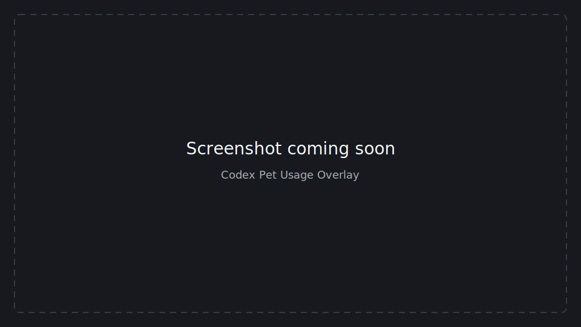

# Codex Pet Usage Overlay

An independent, click-through macOS overlay that shows Codex rate-limit usage when you hover over the Codex desktop pet.

> Public release: v0.1.0

## Screenshot



## Features

- Displays remaining quota for the 5-hour and 7-day rolling windows.
- Shows live reset countdowns in `HH:MM:SS` and `Xd HH:MM` formats.
- Appears after hovering over the Codex pet for one second.
- Follows the pet when its position changes.
- Uses a transparent, borderless, always-on-top, click-through window.
- Includes a menu-bar control, detection-area debugger, cache fallback, and optional launch-at-login support.
- Runs locally without modifying Codex Desktop files or injecting code into the Codex process.

## How It Works

Usage data is collected in this order:

1. Codex's local read-only app-server method, `account/rateLimits/read`.
2. Structured state under `~/.codex` and `~/Library/Application Support/Codex`.
3. Local Codex JSONL session logs.
4. The last successful local cache snapshot.

The pet rectangle is read from `electron-avatar-overlay-bounds.anchor` in `~/.codex/.codex-global-state.json`. Codex and Qt both expose these values as logical desktop coordinates, so Retina and multi-display positions can be tracked without image recognition.

The overlay converts Codex's `usedPercent` values to remaining quota:

```text
remaining = 100 - usedPercent
```

No usage data is uploaded by this application.

## Requirements

- macOS
- Codex Desktop with the pet enabled
- Python 3.9 or newer for source installation
- Accessibility and Input Monitoring permissions may be required for global hover detection on some systems

## Install From Source

```bash
git clone https://github.com/GaofengWu1912/Codex-Pet-Usage-Overlay.git
cd Codex-Pet-Usage-Overlay
python3 -m venv .venv
.venv/bin/python -m pip install -r requirements.txt
.venv/bin/python main.py
```

The app runs as a menu-bar utility. Hover over the Codex pet for one second to display the overlay.

## Build the macOS App

```bash
chmod +x packaging/build_app.sh
./packaging/build_app.sh
```

The verified local build is written to:

```text
dist/CodexPetUsage.app.zip
```

Install it with:

```bash
ditto -x -k dist/CodexPetUsage.app.zip /Applications
open /Applications/CodexPetUsage.app
```

Local builds use ad-hoc signing. Public binary distribution should use a Developer ID certificate and Apple notarization.

## Configuration

On first launch, the default configuration is copied to:

```text
~/Library/Application Support/CodexPetUsage/config.json
```

Useful options include:

- `hover_show_delay_ms`: hover delay, default `1000`.
- `refresh_seconds`: usage refresh interval, default `45`.
- `follow_codex_pet`: automatically follow Codex's saved pet bounds.
- `debug_hover`: write detailed hover coordinates to the local diagnostic log.
- `state_roots`: local Codex state locations used by the fallback collector.

The menu-bar action **Show detection area** visualizes the current pet hit region without intercepting mouse events.

## Tests

```bash
.venv/bin/python -m unittest discover -s tests -v
```

The test suite covers schema normalization, official API payloads, fallback sources, remaining-quota conversion, countdown formatting, hover state transitions, and logical multi-display coordinates.

## Privacy

- Does not read `auth.json`, API keys, or environment secrets.
- Does not modify Codex Desktop, Codex configuration, or Codex session logs.
- Does not inject into or automate the Codex process.
- Reads only local state needed for pet positioning and usage display.

## Disclaimer

Codex Pet Usage Overlay is an independent, unofficial community project. It is not an official OpenAI or Codex plugin and is not affiliated with, endorsed by, or supported by OpenAI. It does not modify Codex Desktop and may need updates if Codex changes its local app-server protocol or state format.

## License

[MIT](LICENSE)
